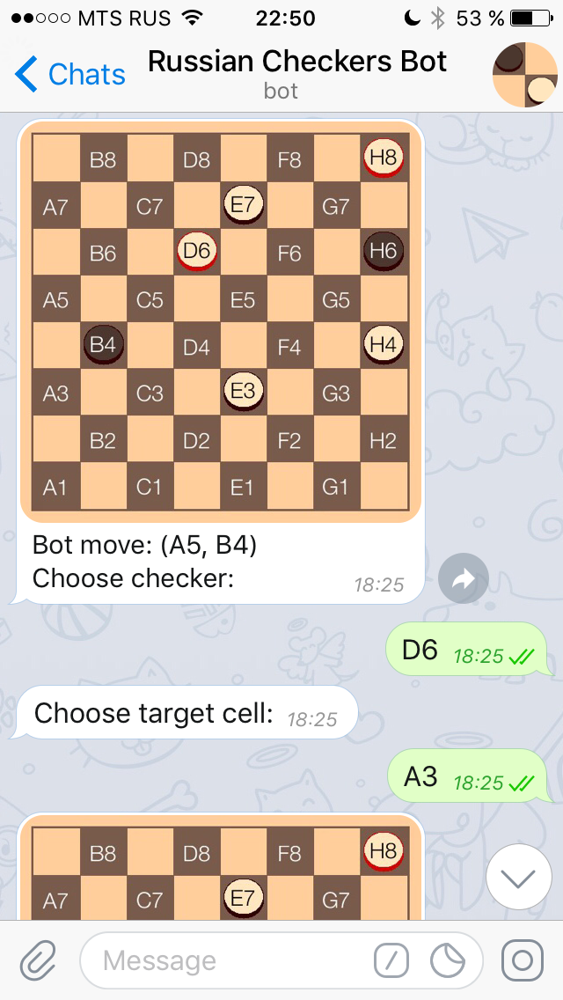
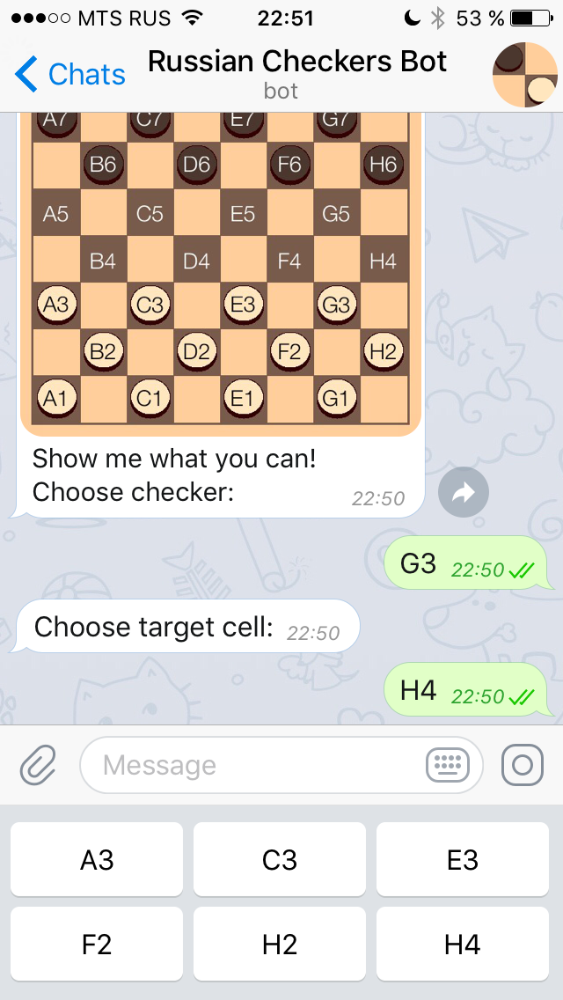

# Russian_checkers

A Telegram bot which plays russian checkers

## Overview

### Features

* Win/lose rate and current games Dropbox backup
* Separate thread to get information about current games' status via commands in terminal
* Logs about games and unexpected situations with logging module
* Image generation with Pillow library

### Screenshots




## Installation

### Warning!!!

The version of Dropbox API used in this project is outdated, update it before deploying!

### Startup

1. Create `bot_config.py` with the following code:

```python
BOT_TOKEN = "TELEGRAM-BOT-TOKEN"
DBX_TOKEN = "DROPBOX_ACCESS_TOKEN"
```

2. Run `bot.py`

3. Enjoy ~~numerous error messages~~ russian checkers!
